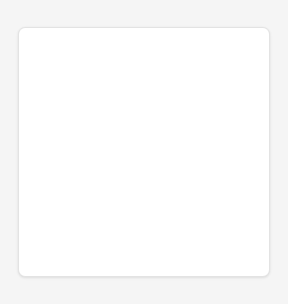
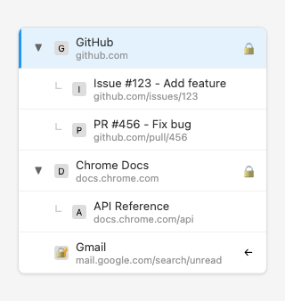
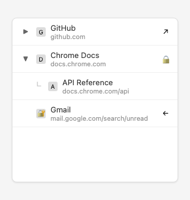
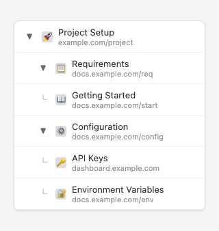
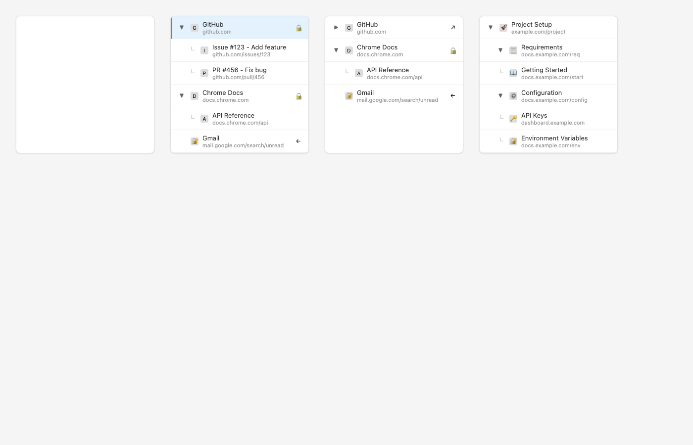

# Tab Tree - Hierarchical Tab Manager

A Chrome extension for managing tabs hierarchically with support for pinning, locking, and drag-and-drop organization.

## Features

- **Hierarchical tabs**: Parent-child tab relationships (1 level nesting)
- **Locked tabs**: Tabs that can't be closed or navigated away
- **Pinned tabs**: Keep important tabs at the top
- **Drag and drop**: Reorder and reorganize tabs
- **Auto-nesting**: Tabs opened from links automatically nest under parent

## Screenshots

### Empty Sidebar (Initial Load)
Shows the extension sidebar when no tabs are open yet.



### Populated Hierarchy
The sidebar with multiple tabs and automatic nesting. Tabs opened from links become children of the parent tab (e.g., GitHub issue opened from GitHub becomes a child).



### Collapsed Parent
Parent tabs can be collapsed (▶) to hide their children, then expanded (▼) to show them again.



### Deep Nesting View
Shows how multiple levels of nesting work with consistent 20px indentation per level.



### Full Demo View
All states shown together for reference:



## Quick Start

```bash
# Install dependencies
npm install

# Build the extension
npm run build

# Run tests (requires built extension)
npm test

# Run tests with UI
npm test -- --headed

# Run tests in debug mode
npm test -- --debug
```

## Development

### Project Structure

```
tab-tree-extension/
├── src/
│   ├── background/
│   │   ├── index.js           # Service worker entry
│   │   ├── tab-manager.js     # Tab tracking (phase 2)
│   │   └── lock-manager.js    # Lock enforcement (phase 4)
│   │
│   ├── sidepanel/
│   │   ├── index.html         # UI container
│   │   ├── index.js           # UI controller
│   │   ├── tree.js            # Tree rendering (phase 2+)
│   │   └── styles.css         # Styling
│   │
│   ├── shared/
│   │   ├── types.js           # Type definitions
│   │   ├── constants.js       # Message types
│   │   └── storage.js         # Storage helpers
│   │
│   └── lib/
│       └── sortable.min.js    # SortableJS (phase 6)
│
├── tests/
│   ├── e2e/
│   │   ├── setup.js           # Test utilities
│   │   ├── hierarchy.spec.js  # Hierarchy tests
│   │   ├── locking.spec.js    # Lock tests
│   │   ├── dragdrop.spec.js   # Drag-drop tests
│   │   └── pinned.spec.js     # Pinned tabs tests
│   │
│   └── unit/
│       ├── tab-manager.test.js
│       └── lock-manager.test.js
│
├── docs/
│   ├── ARCHITECTURE.md        # System overview for AI agents
│   ├── FEATURES.md            # Feature specifications
│   ├── TESTING.md             # Testing guide
│   └── API.md                 # Data structures and messages
│
└── manifest.json              # Chrome extension manifest

```

### Implementation Phases

**Phase 1** (Days 1-2): Skeleton + first E2E test ✓
**Phase 2** (Days 3-4): Tab display + hierarchy
**Phase 3** (Day 5): Collapse/expand
**Phase 4** (Days 6-7): Locked tabs
**Phase 5** (Day 8): Pinned tabs
**Phase 6** (Days 9-10): Drag and drop
**Phase 7** (Days 11-12): Polish + docs

## Screenshots

Screenshots are automatically generated from a demo UI and are part of the development cycle. To regenerate screenshots after UI changes:

```bash
# Generate screenshots
npm run screenshot

# Screenshots are saved to screenshots/ directory
```

This ensures the README always shows the latest UI state.

## Testing

Tests are written with Playwright and test the extension end-to-end:

```bash
# Run all tests
npm test

# Run specific test file
npm test -- tests/e2e/hierarchy.spec.js

# Run with browser visible (headed mode)
npm test -- --headed

# Debug mode (interactive)
npm test -- --debug
```

Tests automatically:
1. Build the extension
2. Launch Chrome with extension loaded
3. Open the side panel
4. Verify functionality

## Documentation

- **ARCHITECTURE.md** - How the system works (for AI agents)
- **FEATURES.md** - Feature specifications and examples
- **TESTING.md** - How to write and run tests
- **API.md** - Data structures and message protocol

## Browser Support

- Chrome 114+
- Edge 114+ (Chromium-based)

## License

MIT
